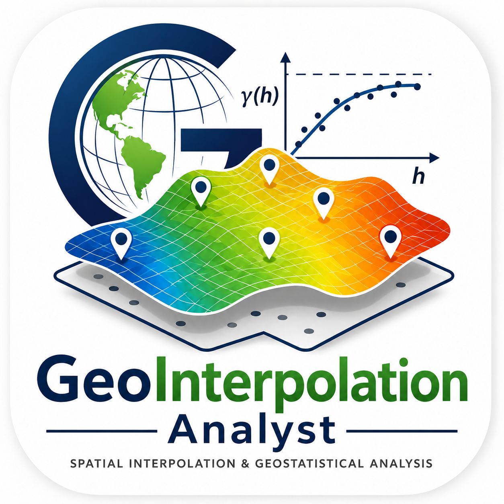

# GeoInterpolation Analyst

<p align="center">
  
</p>

<p align="center">
  <strong>Herramienta avanzada de análisis estadístico espacial, geoestadística e interpolación con validación cruzada para QGIS.</strong>
</p>

<p align="center">
  
  
  
  
  
</p>

---

## 📌 Descripción / Overview

### Español 🇪🇸
**GeoInterpolation Analyst** es un plugin completo e intuitivo para **QGIS** orientado al análisis exploratorio de datos espaciales y tabulares, modelado geoestadístico e interpolación espacial de alta precisión. Integra validación cruzada *Leave-One-Out* (LOOCV) automática para determinar de forma óptima los hiperparámetros de interpolación (potencia, vecinos, núcleos, suavizado y modelos de semivarianza).

### English 🇬🇧
**GeoInterpolation Analyst** is a comprehensive **QGIS** plugin designed for exploratory spatial data analysis (ESDA), geostatistics, and advanced spatial interpolation. It features automated Leave-One-Out Cross-Validation (LOOCV) to optimize interpolation hyperparameters (power, neighbors, kernels, smoothing factors, and variogram models).

---

## 🚀 Estructura del Menú y Módulos / Plugin Structure

El plugin se integra dentro del menú principal **GeoInterpolation Analyst** en la barra de Complementos y en la Caja de Herramientas de Procesos (*Processing Toolbox*):

```
GeoInterpolation Analyst
 ├── 📁 Análisis de datos
 │     ├── 📊 Análisis Estadístico
 │     └── 🗺️ Mapa de Voronoi
 ├── 📁 Interpolación
 │     ├── 🌐 Interpolación IDW con LOOCV
 │     ├── 📈 Interpolación Base Radial con LOOCV
 │     ├── ──────────────────────────────
 │     ├── 🔍 1. Análisis Exploratorio Kriging
 │     ├── 📉 2. Análisis de Variograma
 │     └── 🎯 3. Interpolación Kriging Ordinario
 └── ⚙️ Instalar Dependencias
```

---

## ✨ Características Principales / Key Features

### 1. 📊 Análisis de Datos (Data Analysis)
- **Estadística Descriptiva Completa**:
  - *Tendencia central*: Media, mediana y moda.
  - *Dispersión*: Varianza, desviación estándar y rango.
  - *Posición relativa*: Cuartiles (Q1, Q2, Q3) y percentiles (P90).
  - *Forma*: Coeficiente de asimetría (*skewness*) y curtosis.
- **Prueba de Normalidad**: Test de Shapiro-Wilk para determinar la distribución de las variables.
- **Transformación de Box-Cox**: Estimación automática del parámetro $\lambda$ óptimo para normalizar distribuciones asimétricas.
- **Visualización Gráfica**: Generación automática de histogramas de frecuencias y diagramas de caja (*boxplots*).
- **Exportación**: Tablas resumen en CSV/Excel y creación directa de capas vectoriales en GeoPackage cargadas en el proyecto QGIS.
- **Polígonos de Voronoi (Thiessen)**: Generación de polígonos de influencia a partir de puntos muestrales recortados automáticamente a la extensión del área de estudio.

---

### 2. 🌐 Interpolación con Validación Cruzada (LOOCV)

#### 🔹 IDW con LOOCV (Inverse Distance Weighting)
- Búsqueda en rejilla (*grid search*) iterando sobre potencias de distancia (*Power*) y número de vecinos más cercanos (*Neighbors*).
- Métricas de validación cruzada: **RMSE**, **MAE**, **ME**, **R²** y **Bias**.
- Selección automática del modelo con menor error y generación del raster continuo interpolado.

#### 🔹 Funciones de Base Radial con LOOCV (RBF)
- Evaluación de diversos núcleos o kernels: *multiquadric*, *inverse*, *gaussian*, *linear*, *cubic*, *quintic*, *thin_plate*.
- Optimización de factores de suavizado (*smoothing*) y parámetro $\epsilon$ (*epsilon*).
- Gráficos de ajuste observados vs. predichos y exportación de raster resultante.

#### 🔹 Geoestadística Kriging (Kriging Ordinario)
Flujo guiado paso a paso para interpolación geoestadística:
1. **Análisis Exploratorio Kriging**: Gráfico de nube de semivarianza (*semivariance cloud*) y evaluación de estacionariedad.
2. **Análisis y Ajuste de Variograma**:
   - Ajuste automático y manual de modelos teóricos de variograma: *Esférico*, *Exponencial*, *Gaussiano*, *Lineal*, *Potencia*.
   - Estimación de parámetros: Efecto pepita (*Nugget*), Meseta (*Sill*) y Alcance (*Range*).
3. **Kriging Ordinario**: Interpolación espacial geoestadística mediante la librería `PyKrige`, generando el raster predictivo y reporte detallado de validación.

---

## 📦 Requisitos y Dependencias / Requirements

El plugin requiere las siguientes librerías de Python:
- `pandas`
- `scipy`
- `seaborn`
- `openpyxl`
- `pykrige`
- `scikit-learn`

> 💡 **Instalador Automático**: El plugin incluye una opción integrada (**GeoInterpolation Analyst > Instalar Dependencias**) que detecta e instala automáticamente cualquier paquete faltante dentro del entorno de QGIS.

---

## 🛠️ Instalación / Installation

### Opción 1: Desde archivo ZIP en QGIS
1. Descarga el archivo [`GeoInterpolation_Analyst.zip`](../GeoInterpolation_Analyst.zip).
2. En QGIS, ve al menú superior **Complementos > Administrar e instalar complementos...** (*Plugins > Manage and Install Plugins...*).
3. Selecciona la pestaña **Instalar a partir de ZIP** (*Install from ZIP*).
4. Selecciona el archivo descargado y haz clic en **Instalar complemento**.

### Opción 2: Instalación Manual
1. Copia la carpeta `GeoInterpolation_Analyst` dentro del directorio de plugins de QGIS:
   - **Windows**: `%APPDATA%\QGIS\QGIS3\profiles\default\python\plugins\`
   - **Linux**: `~/.local/share/QGIS/QGIS3/profiles/default/python/plugins/`
   - **macOS**: `~/Library/Application Support/QGIS/QGIS3/profiles/default/python/plugins/`
2. Reinicia QGIS y activa **GeoInterpolation Analyst** desde el administrador de complementos.

---

## 🤝 Soporte y Contacto / Support & Contact

- **Repositorio / Repository**: [GitHub - GeoInterpolation Analyst](https://github.com/Ninobravo55/Geointerpolation_analyst)
- **Autor / Author**: GEOMATICA
- **Sitio Web / Homepage**: [geomatica.pe](https://www.geomatica.pe/)
- **Email**: nino@geomatica.pe / support@geomatica.com
- **Reporte de Errores / Issues**: [GitHub Issues Tracker](https://github.com/Ninobravo55/Geointerpolation_analyst/issues)

---

<p align="center">
  <sub>Desarrollado con ❤️ por <strong><a href="https://www.geomatica.pe/">GEOMATICA</a></strong></sub>
</p>
